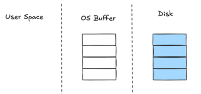
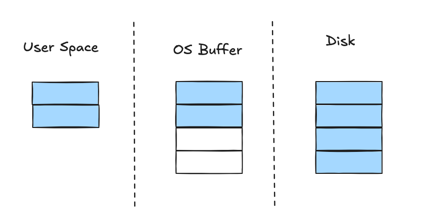
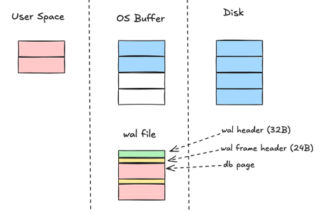
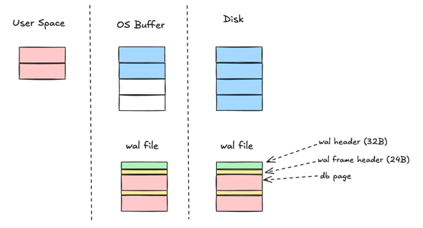

# WAL

This is an overview of the steps SQLite takes in order to perform an atomic commit of a transaction against a single database file in `WAL` journaling mode.

Contents
1. [Atomic Commit](#atomic-commit-in-write-transaction)
   1. [Initial State](#initial-state)
   2. [Acquiring a read lock](#acquiring-an-exclusive-wal-write-lock)
2. [Recovery](#recovery)

## Atomic Commit in Write Transaction
This section talks about how atomicity is ensured in write transaction.

### Initial State
The initial state in `WAL` mode is similar to rollback journaling mode so we have the same description as in the [SQLlite doc](https://www.sqlite.org/atomiccommit.html#_initial_state).

> The state of the computer when a database connection is first opened is shown conceptually by the diagram at the right. The area of the diagram on the extreme right (labeled "Disk") represents information stored on the mass storage device. Each rectangle is a sector. The blue color represents that the sectors contain original data. The middle area is the operating systems disk cache. At the onset of our example, the cache is cold and this is represented by leaving the rectangles of the disk cache empty. The left area of the diagram shows the content of memory for the process that is using SQLite. The database connection has just been opened and no information has been read yet, so the user space is empty.

### Changing Database Pages

Let's say you run an update statement to update some existing data in the database. The library first needs to read in the current data on disk. As shown in the picture the read makes page 1 and 2 available in User Space memory and OS buffer.

### Acquiring an exclusive wal write lock

The WAL_WRITE_LOCK is only locked exclusively. There is never a shared lock taken on WAL_WRITE_LOCK.
- An exclusive WAL_WRITE_LOCK is held by any connection that is appending content to the end of the WAL.
- Hence, only a single process at a time can append content to the WAL.

Does transaction in WAL acquire a read lock?
- sqlite3PagerSharedLock does not lock db file and calls `pagerBeginReadTransaction`. It only locks db file in rollback mode.
- `pagerBeginReadTransaction` then calls `sqlite3WalBeginReadTransaction` to take a snapshot of the wal and wal-index to be used by this thread.
- then a READ_LOCK is acquired on the WAL

Is it a lock on the wal file or db file or both? Seems to be only WAL file.

A transaction modified page 1 and 2 of the database file. These pages are modified in User Space. Then the page contents are attached to WAL file: one page in a WAL frame attached with one wal frame header.

### Flushing WAL File to Persistent Storage

TODO: must add the locking. as flushing requires lock

The next step is to flush the content of the wal file to nonvolatile storage. This is a critical step in insuring that the database can survive an unexpected power loss. This step also takes a lot of time, since writing to nonvolatile storage is normally a slow operation.

Does writing WAL file needs 2 flushes (one  for content and one for header)? 

### Releasing WAL File Lock

The last step in the commit process is to release the exclusive WAL_WRITE_LOCK so that other processes which wants to comment their transaction can write to the WAL file.

## Recovery

To quote SQLite doc:
> An atomic commit is supposed to happen instantaneously. But the processing described above clearly takes a finite amount of time. Suppose the power to the computer were cut part way through the commit operation described above. 

To maintain the illusion to database client that the changes are atomic, we have to `undo` the changes written to the `wal` file before the beginning of the transaction.

## Thinking notes
- readers lock wal file and establishes its end mark when it opens its transaction, not when first page is read from wal file.
- It has to be this way because the new reader expects to be able to read the last few frames of the wal file (those that have not already been checkpointed).
- If a "PRAGMA wal_checkpoint = TRUNCATE" were allowed to proceed, they might not be available when required by the reader.

`pagerBeginReadTransaction(Pager *pPager)` begins a read txn on the WAL.
- This routine used to be called "pagerOpenSnapshot()" 
- because it essentially makes a snapshot of the database at the current point in time and keeps that snapshot for use by the `reader` in spite of **concurrently** changes by other `writers` or  `checkpointers`.
- the pager needs to be either in PAGER_OPEN or PAGER_READER mode: `assert( pPager->eState==PAGER_OPEN || pPager->eState==PAGER_READER )`
